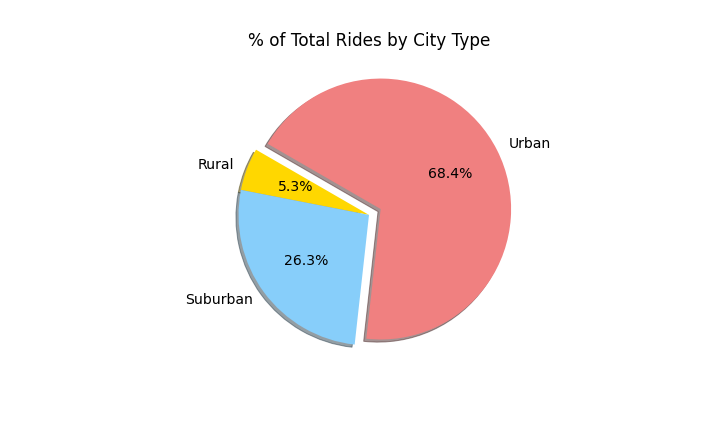
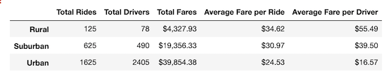

# PyBer_Analysis

## Analysis Overview

The purpose of this analysis is to identify how the ride-sharing data differs by city type and how those differences can help the decision-makers at Pyber.

# Analysis
The analysis was performed by creating pie charts, a summary DataFrame of the ride-sharing data by city type and a multiple-line graph that represents the total weekly fares for each city type using Python, Pandas and Matplolib.

## Results

### Total Rides by City Type

- As seen on the image below, the Urban City Rides with 1625 rides takes the biggest portion of the pie chart representing 68.4% of the total rides.
- Suburban Cities take the second place with 625 rides being 26.3% of the total rides.
- Rural cities take the third place with only 125 rides being 5.3% of the total rides.

### Total Drivers by City Type

- The following pie chart represents the total drivers by city type.
- Urban city type, had 2,405 drivers taking 80.9% of the pie chart. 
- Suburban cities had 490 drivers representing 16.5% of the total drivers.
- Rural cities had only 68 drivers representing 5.3% of the total drivers.

### Total Fares by City Type

- As seen on the image below:
- Urban cities had $39,854.38 in transactions which represents 62.7% of the total fares.
- Suburban cities had $19,356.33 in transactions representing 30.5% of the total fares.
- Rural cities had only $4,327.93 of the transactions representing 6.8% of the total fares.

The image below displays the Pyber Summary DataFrame, where we can see the ride-share data differences between Urban, Suburban and Rural cities.

- Urban cities have the highest number of Total Rides Total Drivers, and the biggest amount of Total Fares, while at the same time having the lowest Average Fare per Ride and Average Fare per Driver.

- Suburban cities were the ones in the middle for all the results.

- On the other extreme, Rural cities were the ones with the lowest amount of Total Rides, Total Drivers, and Total Fares. While the Average Fare per Ride and Average Fare per Driver were the highest among all three different types of cities.

 

The following chart represents the Pyber Fare Summary where the lines show the Total Fare by City Type and each peak or drop is a different week between the dates of Jan/01/2019 to April/28/2019.

 - The yellow line represents the Urban cities trend over the 5 months period, starting at a Total Fare of $1,661.68 and ending at $2,238.29. 

 - The red line shows the Suburban cities trend where the Total Fare starts at $7,21.60 and ends at $1,357.75.

 - The blue line displays the Rural cities trend starting at $187.92 and having a increasing to $191.85.

 - Something else worth mentioning is that all three city types had a pick in the total fare at the 3rd week of February.

## Conclusion 

Urban cities have the highest amount of ride-share trips and consequently more drivers, which results in the largest amount of transactions happening there compared to Suburban and Rural cities.

This can be interpreted by: the more dense and concentrated a city is, the highest demand and lower price it has.
Where the more dispersed a city is, the demand is lower and price is high.

## Summary

Business Recommendations:

- In order to increase the % of Total Rides for Suburban and Rural cities, one recommendation is to lower the fare price, therefore increasing accessibility.

- In order the increase the % of Total Drivers for the Suburban and Rural cities, the recommendation is to hire more drivers, therefore increasing availability.

- In order to increase the % of Total Fares for the Suburban and Rural cities, the recommendation is also to lower the price fare and hire more drivers, as seen on the outcomes for the Urban cities, increasing accessibility and availability brings a higher percentage of total transactions.

